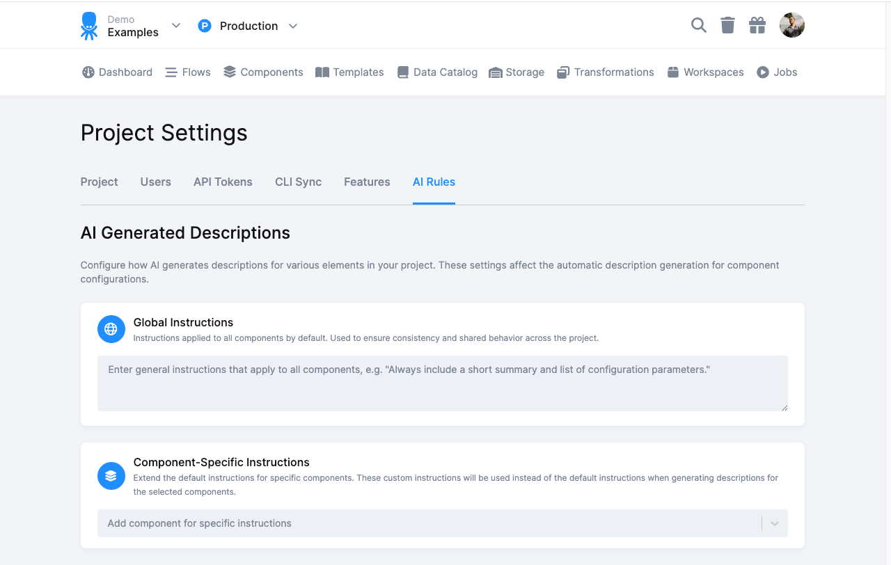

* TOC
{:toc}

The **AI Rules** section allows users to define specific instructions for AI functionality within Keboola Connection. Currently, users can customize how the **AI Generated Descriptions** feature behaves and responds in different contexts.

**Customizable AI Instructions**

- Users can set default guidelines for how the AI should behave.
- They can create specific instructions for different components.
- This helps ensure the AI responds consistently and appropriately, following user-defined styles.  
  For instance, users might instruct the AI to write all descriptions in a specific language.

**Context-Aware Behavior**

- Different components can have their own specific rules.
- For example, when describing code, the AI might be instructed to follow a particular descriptive structure.
- When working with Flows, it might follow different writing guidelines.



## Global Instructions

**Global instructions** are the default guidelines that apply to all components. You can define the AI’s general behavior for generating descriptions here.

## Component-Specific Instructions

**Component-specific instructions** allow you to define unique rules for individual components. This is useful when you want the AI to adapt its behavior depending on the context.  

For example, you might want the AI to use a more technical tone when describing code, and a more casual tone when describing Flows. **Note** that you can only select from components **that already have a configuration** in the project.

Component-specific instructions extend the global instructions. This means that if a specific instruction is defined for a component, the global instruction will still apply to it as well.

For example, suppose you have:
- A global instruction: _“Write all texts in Czech language.”_
- A component-specific instruction for the **SQL Transformation** component: _“Write a brief high-level description focusing on inputs and outputs of the transformation in two paragraphs.”_

In this case, the final instruction for the **SQL Transformation** component will be:

```
Write all texts in Czech language. Write a brief high-level description focusing on inputs and outputs of the transformation in two paragraphs.
```